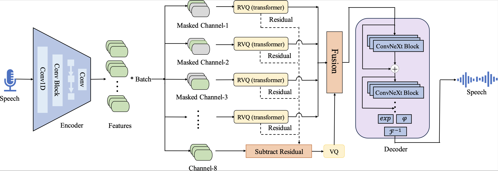
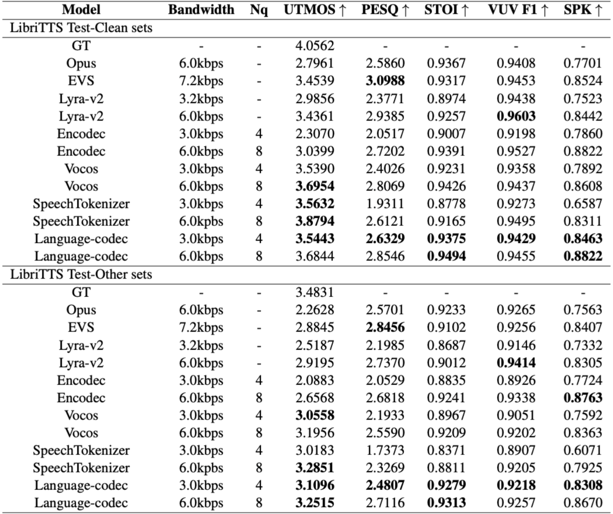

{:.no_toc}

## Overview

In recent years, large language models have achieved significant success in generative tasks (e.g., speech cloning and audio generation) related to speech, audio, music, and other signal domains. A crucial element of these models is the discrete acoustic codecs, which serves as an intermediate representation replacing the mel-spectrogram. However, there exist several gaps between discrete codecs and downstream speech language models. Specifically, 1) most codec models are trained on only 1,000 hours of data, whereas most speech language models are trained on 60,000 hours; 2) Achieving good reconstruction performance requires the utilization of numerous codebooks, which increases the burden on downstream speech language models; 3) The initial channel of the codebooks contains excessive information, making it challenging to directly generate acoustic tokens from weakly supervised signals such as text in downstream tasks. Consequently, leveraging the characteristics of speech language models, we propose Language-Codec. In the Language-Codec, we introduce a Mask Channel Residual Vector Quantization (MCRVQ) mechanism along with improved Fourier transform structures and larger training datasets to address the aforementioned gaps. We compare our method with competing audio compression algorithms and observe significant outperformance across extensive evaluations. Furthermore, we also validate the efficiency of the Language-Codec on downstream speech language models.

## Model Architecture

On the far left is the encoder downsampling module, which
still utilizes the model structure of Encodec. On the far right is the decoder upsampling module, where we have
replaced it with Vocos’ model structure. the middle part is the Mask Channel Residual Vector Quantization module,
with the gray blocks indicating the masked portion of temporal information.

<table>
    <tr>
        <td >
 
</td>
    </tr>
</table>

Figure.1 The overall architecture of Language-Codec.

## Experiments

We evaluated the performance of the codec model on the test set of LibriTTS. The Test-Clean collection consists of 4,837 audio samples, while the Test-Other collection, which mostly contains audio recorded in noisy environments, comprises a total of 5,120 audio samples. Considering that the primary purpose of the discrete codecs is to serve as an audio representation for downstream tasks, excessive channel numbers would significantly burden downstream speech language models. Therefore, we conducted a comparison between four-channel and eight-channel dimensions. Among the objective metrics we employed, UTMOS and speaker similarity metrics closely approximate the subjective perception of human listeners. On the other hand, PESQ, STOI, and F1 metrics are more indicative of the inherent quality of the audio signal. Due to the subtle differences in UTMOS, we will highlight the top two models with the highest UTMOS scores for each channel. As for the remaining objective audio quality metrics, we will only highlight the highest-performing model. The experimental results are shown in Table 1.

<table>
    <tr>
        <td >
 
</td>
    </tr>
</table>

Table.1 The results of different codec models on the LibriTTS Test-Clean and Test-Other dataset.

## Librispeech Test Clean

&nbsp;
 
