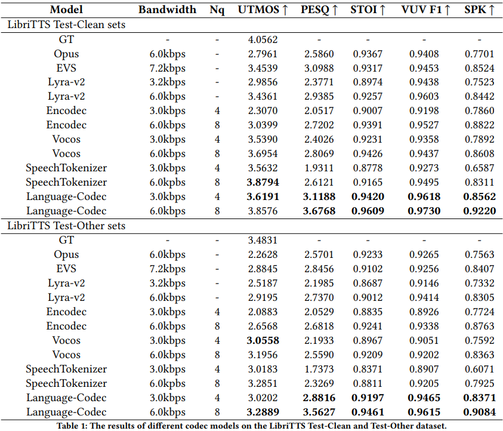

{:.no_toc}

## Overview

In recent years, large language models have achieved significant success in generative tasks (e.g., speech cloning and audio generation) related to speech, audio, music, and other signal domains. A crucial element of these models is the discrete acoustic codecs, which serves as an intermediate representation replacing the mel-spectrogram. However, there exist several gaps between discrete codecs and downstream speech language models. Specifically, 1) most codec models are trained on only 1,000 hours of data, whereas most speech language models are trained on 60,000 hours; 2) Achieving good reconstruction performance requires the utilization of numerous codebooks, which increases the burden on downstream speech language models; 3) The initial channel of the codebooks contains excessive information, making it challenging to directly generate acoustic tokens from weakly supervised signals such as text in downstream tasks. Consequently, leveraging the characteristics of speech language models, we propose Language-Codec. In the Language-Codec, we introduce a Mask Channel Residual Vector Quantization (MCRVQ) mechanism along with improved Fourier transform structures and larger training datasets to address the aforementioned gaps. We compare our method with competing audio compression algorithms and observe significant outperformance across extensive evaluations. Furthermore, we also validate the efficiency of the Language-Codec on downstream speech language models.

## Model Architecture

On the far left is the encoder downsampling module, which
still utilizes the model structure of Encodec. On the far right is the decoder upsampling module, where we have
replaced it with Vocos’ model structure. the middle part is the Mask Channel Residual Vector Quantization module,
with the gray blocks indicating the masked portion of temporal information.

<table>
    <tr>
        <td >
 
</td>
    </tr>
</table>

Figure.1 The overall architecture of Language-Codec.

## Experiments

We evaluated the performance of the codec model on the test set of LibriTTS. The Test-Clean collection consists of 4,837 audio samples, while the Test-Other collection, which mostly contains audio recorded in noisy environments, comprises a total of 5,120 audio samples. Considering that the primary purpose of the discrete codecs is to serve as an audio representation for downstream tasks, excessive channel numbers would significantly burden downstream speech language models. Therefore, we conducted a comparison between four-channel and eight-channel dimensions. Among the objective metrics we employed, UTMOS and speaker similarity metrics closely approximate the subjective perception of human listeners. On the other hand, PESQ, STOI, and F1 metrics are more indicative of the inherent quality of the audio signal. Due to the subtle differences in UTMOS, we will highlight the top two models with the highest UTMOS scores for each channel. As for the remaining objective audio quality metrics, we will only highlight the highest-performing model. The experimental results are shown in Table 1.

<table>
    <tr>
        <td >
 
</td>
    </tr>
</table>

Table.1 The results of different codec models on the LibriTTS Test-Clean and Test-Other dataset.

## Compare with others

We provide ten sets of audio to compare the effects of languagecodec and other models.

&nbsp;
 
1.He felt above him the vast indifferent dome and the calm processes of the heavenly bodies; and the earth beneath him, the earth that had borne him, had taken him to her breast. 
<table>
    <tr>
        <th> GT</th>
        <th> Opus(6.0kbps) </th>
        <th> EVS(7.2kbps)</th>
        <th> Lyra-v2(6.0kbps)</th>
        <th> Encodec(6.0kbps)</th>
        <th> SpeechTokenizer(6.0kbps)</th>
        <th> LanguageCodec(6.0kbps)</th>
    </tr>
    <tr>
        <th> <audio controls id="player" onplay="pauseOthers(this);"><source src="assets/audios/1/1089_134691_000052_000000.wav" type="audio/mpeg"></audio> </th>
        <th> <audio controls id="player" onplay="pauseOthers(this);"><source src="assets/audios/1/opus_1089_134691_000052_000000.wav" type="audio/mpeg"></audio> </th>
        <th> <audio controls id="player" onplay="pauseOthers(this);"><source src="assets/audios/1/evs_1089_134691_000052_000000.wav" type="audio/mpeg"></audio> </th>
        <th> <audio controls id="player" onplay="pauseOthers(this);"><source src="assets/audios/1/lyra_1089_134691_000052_000000_decoded.wav" type="audio/mpeg"></audio> </th>
        <th> <audio controls id="player" onplay="pauseOthers(this);"><source src="assets/audios/1/encodec_1089_134691_000052_000000.wav" type="audio/mpeg"></audio> </th>
        <th> <audio controls id="player" onplay="pauseOthers(this);"><source src="assets/audios/1/st_1089_134691_000052_000000.wav" type="audio/mpeg"></audio> </th>
        <th> <audio controls id="player" onplay="pauseOthers(this);"><source src="assets/audios/1089_134691_000052_000000.wav" type="audio/mpeg"></audio> </th>
    </tr> 
</table>

&nbsp;
 
2.Such is their ponderous weight that they cannot rise from the horizon; but, obeying an impulse from higher currents, their dense consistency slowly yields. 
<table>
    <tr>
        <th> GT</th>
        <th> Opus(6.0kbps) </th>
        <th> EVS(7.2kbps)</th>
        <th> Lyra-v2(6.0kbps)</th>
        <th> Encodec(6.0kbps)</th>
        <th> SpeechTokenizer(6.0kbps)</th>
        <th> LanguageCodec(6.0kbps)</th>
    </tr>
    <tr>
        <th> <audio controls id="player" onplay="pauseOthers(this);"><source src="assets/audios/2/260_123288_000006_000002.wav" type="audio/mpeg"></audio> </th>
        <th> <audio controls id="player" onplay="pauseOthers(this);"><source src="assets/audios/2/opus_260_123288_000006_000002.wav" type="audio/mpeg"></audio> </th>
        <th> <audio controls id="player" onplay="pauseOthers(this);"><source src="assets/audios/2/evs_260_123288_000006_000002.wav" type="audio/mpeg"></audio> </th>
        <th> <audio controls id="player" onplay="pauseOthers(this);"><source src="assets/audios/2/lyra_260_123288_000006_000002_decoded.wav" type="audio/mpeg"></audio> </th>
        <th> <audio controls id="player" onplay="pauseOthers(this);"><source src="assets/audios/2/encodec_260_123288_000006_000002.wav" type="audio/mpeg"></audio> </th>
        <th> <audio controls id="player" onplay="pauseOthers(this);"><source src="assets/audios/2/st_260_123288_000006_000002.wav" type="audio/mpeg"></audio> </th>
        <th> <audio controls id="player" onplay="pauseOthers(this);"><source src="assets/audios/260_123288_000006_000002.wav" type="audio/mpeg"></audio> </th>
    </tr> 
</table>

&nbsp;
 
3.Now let the devils strike our scent!" said the scout, tearing two rifles, with all their attendant accouterments, from beneath a bush, and flourishing "killdeer" as he handed Uncas his weapon; "two, at least, will find it to their deaths. 
<table>
    <tr>
        <th> GT</th>
        <th> Opus(6.0kbps) </th>
        <th> EVS(7.2kbps)</th>
        <th> Lyra-v2(6.0kbps)</th>
        <th> Encodec(6.0kbps)</th>
        <th> SpeechTokenizer(6.0kbps)</th>
        <th> LanguageCodec(6.0kbps)</th>
    </tr>
    <tr>
        <th> <audio controls id="player" onplay="pauseOthers(this);"><source src="assets/audios/3/1320_122617_000069_000000.wav" type="audio/mpeg"></audio> </th>
        <th> <audio controls id="player" onplay="pauseOthers(this);"><source src="assets/audios/3/opus_1320_122617_000069_000000.wav" type="audio/mpeg"></audio> </th>
        <th> <audio controls id="player" onplay="pauseOthers(this);"><source src="assets/audios/3/evs_1320_122617_000069_000000.wav" type="audio/mpeg"></audio> </th>
        <th> <audio controls id="player" onplay="pauseOthers(this);"><source src="assets/audios/3/lyra_1320_122617_000069_000000_decoded.wav" type="audio/mpeg"></audio> </th>
        <th> <audio controls id="player" onplay="pauseOthers(this);"><source src="assets/audios/3/encodec_1320_122617_000069_000000.wav" type="audio/mpeg"></audio> </th>
        <th> <audio controls id="player" onplay="pauseOthers(this);"><source src="assets/audios/3/st_1320_122617_000069_000000.wav" type="audio/mpeg"></audio> </th>
        <th> <audio controls id="player" onplay="pauseOthers(this);"><source src="assets/audios/1320_122617_000069_000000.wav" type="audio/mpeg"></audio> </th>
    </tr> 
</table>

&nbsp;
 
4.Well, if there is nothing to be learned here, we had best go inside. 
<table>
    <tr>
        <th> GT</th>
        <th> Opus(6.0kbps) </th>
        <th> EVS(7.2kbps)</th>
        <th> Lyra-v2(6.0kbps)</th>
        <th> Encodec(6.0kbps)</th>
        <th> SpeechTokenizer(6.0kbps)</th>
        <th> LanguageCodec(6.0kbps)</th>
    </tr>
    <tr>
        <th> <audio controls id="player" onplay="pauseOthers(this);"><source src="assets/audios/4/1580_141083_000043_000001.wav" type="audio/mpeg"></audio> </th>
        <th> <audio controls id="player" onplay="pauseOthers(this);"><source src="assets/audios/4/opus_1580_141083_000043_000001.wav" type="audio/mpeg"></audio> </th>
        <th> <audio controls id="player" onplay="pauseOthers(this);"><source src="assets/audios/4/evs_1580_141083_000043_000001.wav" type="audio/mpeg"></audio> </th>
        <th> <audio controls id="player" onplay="pauseOthers(this);"><source src="assets/audios/4/lyra_1580_141083_000043_000001_decoded.wav" type="audio/mpeg"></audio> </th>
        <th> <audio controls id="player" onplay="pauseOthers(this);"><source src="assets/audios/4/encodec_1580_141083_000043_000001.wav" type="audio/mpeg"></audio> </th>
        <th> <audio controls id="player" onplay="pauseOthers(this);"><source src="assets/audios/4/st_1580_141083_000043_000001.wav" type="audio/mpeg"></audio> </th>
        <th> <audio controls id="player" onplay="pauseOthers(this);"><source src="assets/audios/1580_141083_000043_000001.wav" type="audio/mpeg"></audio> </th>
    </tr> 
</table>

&nbsp;
 
5.He grasped his hoe and started briskly to work. 
<table>
    <tr>
        <th> GT</th>
        <th> Opus(6.0kbps) </th>
        <th> EVS(7.2kbps)</th>
        <th> Lyra-v2(6.0kbps)</th>
        <th> Encodec(6.0kbps)</th>
        <th> SpeechTokenizer(6.0kbps)</th>
        <th> LanguageCodec(6.0kbps)</th>
    </tr>
    <tr>
        <th> <audio controls id="player" onplay="pauseOthers(this);"><source src="assets/audios/5/1995_1826_000051_000001.wav" type="audio/mpeg"></audio> </th>
        <th> <audio controls id="player" onplay="pauseOthers(this);"><source src="assets/audios/5/opus_1995_1826_000051_000001.wav" type="audio/mpeg"></audio> </th>
        <th> <audio controls id="player" onplay="pauseOthers(this);"><source src="assets/audios/5/evs_1995_1826_000051_000001.wav" type="audio/mpeg"></audio> </th>
        <th> <audio controls id="player" onplay="pauseOthers(this);"><source src="assets/audios/5/lyra_1995_1826_000051_000001_decoded.wav" type="audio/mpeg"></audio> </th>
        <th> <audio controls id="player" onplay="pauseOthers(this);"><source src="assets/audios/5/encodec_1995_1826_000051_000001.wav" type="audio/mpeg"></audio> </th>
        <th> <audio controls id="player" onplay="pauseOthers(this);"><source src="assets/audios/5/st_1995_1826_000051_000001.wav" type="audio/mpeg"></audio> </th>
        <th> <audio controls id="player" onplay="pauseOthers(this);"><source src="assets/audios/1995_1826_000051_000001.wav" type="audio/mpeg"></audio> </th>
    </tr> 
</table>

&nbsp;
 
6.Critias when he told this tale of the olden time, was ninety years old, I being not more than ten. 
<table>
    <tr>
        <th> GT</th>
        <th> Opus(6.0kbps) </th>
        <th> EVS(7.2kbps)</th>
        <th> Lyra-v2(6.0kbps)</th>
        <th> Encodec(6.0kbps)</th>
        <th> SpeechTokenizer(6.0kbps)</th>
        <th> LanguageCodec(6.0kbps)</th>
    </tr>
    <tr>
        <th> <audio controls id="player" onplay="pauseOthers(this);"><source src="assets/audios/6/2961_961_000004_000002.wav" type="audio/mpeg"></audio> </th>
        <th> <audio controls id="player" onplay="pauseOthers(this);"><source src="assets/audios/6/opus_2961_961_000004_000002.wav" type="audio/mpeg"></audio> </th>
        <th> <audio controls id="player" onplay="pauseOthers(this);"><source src="assets/audios/6/evs_2961_961_000004_000002.wav" type="audio/mpeg"></audio> </th>
        <th> <audio controls id="player" onplay="pauseOthers(this);"><source src="assets/audios/6/lyra_2961_961_000004_000002_decoded.wav" type="audio/mpeg"></audio> </th>
        <th> <audio controls id="player" onplay="pauseOthers(this);"><source src="assets/audios/6/encodec_2961_961_000004_000002.wav" type="audio/mpeg"></audio> </th>
        <th> <audio controls id="player" onplay="pauseOthers(this);"><source src="assets/audios/6/st_2961_961_000004_000002.wav" type="audio/mpeg"></audio> </th>
        <th> <audio controls id="player" onplay="pauseOthers(this);"><source src="assets/audios/2961_961_000004_000002.wav" type="audio/mpeg"></audio> </th>
    </tr>
</table>

&nbsp;
 
7.Stung by anxiety for this little sister, she upbraided Miss W--- for her fancied indifference to Anne's state of health. 
<table>
    <tr>
        <th> GT</th>
        <th> Opus(6.0kbps) </th>
        <th> EVS(7.2kbps)</th>
        <th> Lyra-v2(6.0kbps)</th>
        <th> Encodec(6.0kbps)</th>
        <th> SpeechTokenizer(6.0kbps)</th>
        <th> LanguageCodec(6.0kbps)</th>
    </tr>
    <tr>
        <th> <audio controls id="player" onplay="pauseOthers(this);"><source src="assets/audios/7/3575_170457_000048_000000.wav" type="audio/mpeg"></audio> </th>
        <th> <audio controls id="player" onplay="pauseOthers(this);"><source src="assets/audios/7/opus_3575_170457_000048_000000.wav" type="audio/mpeg"></audio> </th>
        <th> <audio controls id="player" onplay="pauseOthers(this);"><source src="assets/audios/7/evs_3575_170457_000048_000000.wav" type="audio/mpeg"></audio> </th>
        <th> <audio controls id="player" onplay="pauseOthers(this);"><source src="assets/audios/7/lyra_3575_170457_000048_000000_decoded.wav" type="audio/mpeg"></audio> </th>
        <th> <audio controls id="player" onplay="pauseOthers(this);"><source src="assets/audios/7/encodec_3575_170457_000048_000000.wav" type="audio/mpeg"></audio> </th>
        <th> <audio controls id="player" onplay="pauseOthers(this);"><source src="assets/audios/7/st_3575_170457_000048_000000.wav" type="audio/mpeg"></audio> </th>
        <th> <audio controls id="player" onplay="pauseOthers(this);"><source src="assets/audios/3575_170457_000048_000000.wav" type="audio/mpeg"></audio> </th>
    </tr> 
</table>

&nbsp;
 
8.It's delightful to hear it in a London theatre. 
<table>
    <tr>
        <th> GT</th>
        <th> Opus(6.0kbps) </th>
        <th> EVS(7.2kbps)</th>
        <th> Lyra-v2(6.0kbps)</th>
        <th> Encodec(6.0kbps)</th>
        <th> SpeechTokenizer(6.0kbps)</th>
        <th> LanguageCodec(6.0kbps)</th>
    </tr>
    <tr>
        <th> <audio controls id="player" onplay="pauseOthers(this);"><source src="assets/audios/8/4446_2271_000007_000002.wav" type="audio/mpeg"></audio> </th>
        <th> <audio controls id="player" onplay="pauseOthers(this);"><source src="assets/audios/8/opus_4446_2271_000007_000002.wav" type="audio/mpeg"></audio> </th>
        <th> <audio controls id="player" onplay="pauseOthers(this);"><source src="assets/audios/8/evs_4446_2271_000007_000002.wav" type="audio/mpeg"></audio> </th>
        <th> <audio controls id="player" onplay="pauseOthers(this);"><source src="assets/audios/8/lyra_4446_2271_000007_000002_decoded.wav" type="audio/mpeg"></audio> </th>
        <th> <audio controls id="player" onplay="pauseOthers(this);"><source src="assets/audios/8/encodec_4446_2271_000007_000002.wav" type="audio/mpeg"></audio> </th>
        <th> <audio controls id="player" onplay="pauseOthers(this);"><source src="assets/audios/8/st_4446_2271_000007_000002.wav" type="audio/mpeg"></audio> </th>
        <th> <audio controls id="player" onplay="pauseOthers(this);"><source src="assets/audios/4446_2271_000007_000002.wav" type="audio/mpeg"></audio> </th>
    </tr> 
</table>

&nbsp;
 
9.The carey housewarming. 
<table>
    <tr>
        <th> GT</th>
        <th> Opus(6.0kbps) </th>
        <th> EVS(7.2kbps)</th>
        <th> Lyra-v2(6.0kbps)</th>
        <th> Encodec(6.0kbps)</th>
        <th> SpeechTokenizer(6.0kbps)</th>
        <th> LanguageCodec(6.0kbps)</th>
    </tr> 
    <tr>
        <th> <audio controls id="player" onplay="pauseOthers(this);"><source src="assets/audios/9/4992_41806_000001_000000.wav" type="audio/mpeg"></audio> </th>
        <th> <audio controls id="player" onplay="pauseOthers(this);"><source src="assets/audios/9/opus_4992_41806_000001_000000.wav" type="audio/mpeg"></audio> </th>
        <th> <audio controls id="player" onplay="pauseOthers(this);"><source src="assets/audios/9/evs_4992_41806_000001_000000.wav" type="audio/mpeg"></audio> </th>
        <th> <audio controls id="player" onplay="pauseOthers(this);"><source src="assets/audios/9/lyra_4992_41806_000001_000000_decoded.wav" type="audio/mpeg"></audio> </th>
        <th> <audio controls id="player" onplay="pauseOthers(this);"><source src="assets/audios/9/encodec_4992_41806_000001_000000.wav" type="audio/mpeg"></audio> </th>
        <th> <audio controls id="player" onplay="pauseOthers(this);"><source src="assets/audios/9/st_4992_41806_000001_000000.wav" type="audio/mpeg"></audio> </th>
        <th> <audio controls id="player" onplay="pauseOthers(this);"><source src="assets/audios/4992_41806_000001_000000.wav" type="audio/mpeg"></audio> </th>
    </tr> 
</table>

&nbsp;
 
10.This was at the March election, eighteen fifty five. 
<table>
    <tr>
        <th> GT</th>
        <th> Opus(6.0kbps) </th>
        <th> EVS(7.2kbps)</th>
        <th> Lyra-v2(6.0kbps)</th>
        <th> Encodec(6.0kbps)</th>
        <th> SpeechTokenizer(6.0kbps)</th>
        <th> LanguageCodec(6.0kbps)</th>
    </tr> 
    <tr>
        <th> <audio controls id="player" onplay="pauseOthers(this);"><source src="assets/audios/10/7729_102255_000002_000003.wav" type="audio/mpeg"></audio> </th>
        <th> <audio controls id="player" onplay="pauseOthers(this);"><source src="assets/audios/10/opus_7729_102255_000002_000003.wav" type="audio/mpeg"></audio> </th>
        <th> <audio controls id="player" onplay="pauseOthers(this);"><source src="assets/audios/10/evs_7729_102255_000002_000003.wav" type="audio/mpeg"></audio> </th>
        <th> <audio controls id="player" onplay="pauseOthers(this);"><source src="assets/audios/10/lyra_7729_102255_000002_000003_decoded.wav" type="audio/mpeg"></audio> </th>
        <th> <audio controls id="player" onplay="pauseOthers(this);"><source src="assets/audios/10/encodec_7729_102255_000002_000003.wav" type="audio/mpeg"></audio> </th>
        <th> <audio controls id="player" onplay="pauseOthers(this);"><source src="assets/audios/10/st_7729_102255_000002_000003.wav" type="audio/mpeg"></audio> </th>
        <th> <audio controls id="player" onplay="pauseOthers(this);"><source src="assets/audios/7729_102255_000002_000003.wav" type="audio/mpeg"></audio> </th>
    </tr> 
</table>

## More Audios 

Here, we provide more audio samples to demonstrate the differences between languagecodec and GT.

&nbsp;
 
1.Let me not survive my disgrace! 
<table>
    <tr>
        <th> GT</th>
        <th> LanguageCodec(6.0kbps)</th>
    </tr> 
    <tr>
        <th> <audio controls id="player" onplay="pauseOthers(this);"><source src="assets/more_audios/5639_40744_000003_000010.wav" type="audio/mpeg"></audio> </th>
        <th> <audio controls id="player" onplay="pauseOthers(this);"><source src="assets/more_audios/languagecodec_5639_40744_000003_000010.wav" type="audio/mpeg"></audio> </th>
    </tr> 
</table>   
            

&nbsp;
 
2.Dr rohlfs writes to me that he found the mixed races in the great sahara, derived from arabs, berbers, and negroes of three tribes, extraordinarily fertile. 
<table>
    <tr>
        <th> GT</th>
        <th> LanguageCodec(6.0kbps)</th>
    </tr> 
    <tr>
        <th> <audio controls id="player" onplay="pauseOthers(this);"><source src="assets/more_audios/5142_36600_000011_000012.wav" type="audio/mpeg"></audio> </th>
        <th> <audio controls id="player" onplay="pauseOthers(this);"><source src="assets/more_audios/languagecodec_5142_36600_000011_000012.wav" type="audio/mpeg"></audio> </th>
    </tr> 
</table>   
            

&nbsp;
 
3."how long ago were you arrested?" asked beth. 
<table>
    <tr>
        <th> GT</th>
        <th> LanguageCodec(6.0kbps)</th>
    </tr> 
    <tr>
        <th> <audio controls id="player" onplay="pauseOthers(this);"><source src="assets/more_audios/6829_68769_000057_000000.wav" type="audio/mpeg"></audio> </th>
        <th> <audio controls id="player" onplay="pauseOthers(this);"><source src="assets/more_audios/languagecodec_6829_68769_000057_000000.wav" type="audio/mpeg"></audio> </th>
    </tr> 
</table>   
            

&nbsp;
 
4.Then i fell down at tom temple's feet. 
<table>
    <tr>
        <th> GT</th>
        <th> LanguageCodec(6.0kbps)</th>
    </tr> 
    <tr>
        <th> <audio controls id="player" onplay="pauseOthers(this);"><source src="assets/more_audios/6930_81414_000047_000003.wav" type="audio/mpeg"></audio> </th>
        <th> <audio controls id="player" onplay="pauseOthers(this);"><source src="assets/more_audios/languagecodec_6930_81414_000047_000003.wav" type="audio/mpeg"></audio> </th>
    </tr> 
</table>   
            

&nbsp;
 
5.he's better now. 
<table>
    <tr>
        <th> GT</th>
        <th> LanguageCodec(6.0kbps)</th>
    </tr> 
    <tr>
        <th> <audio controls id="player" onplay="pauseOthers(this);"><source src="assets/more_audios/6930_81414_000049_000000.wav" type="audio/mpeg"></audio> </th>
        <th> <audio controls id="player" onplay="pauseOthers(this);"><source src="assets/more_audios/languagecodec_6930_81414_000049_000000.wav" type="audio/mpeg"></audio> </th>
    </tr> 
</table>   
            

&nbsp;
 
6.Conclusion. 
<table>
    <tr>
        <th> GT</th>
        <th> LanguageCodec(6.0kbps)</th>
    </tr> 
    <tr>
        <th> <audio controls id="player" onplay="pauseOthers(this);"><source src="assets/more_audios/7021_79759_000001_000000.wav" type="audio/mpeg"></audio> </th>
        <th> <audio controls id="player" onplay="pauseOthers(this);"><source src="assets/more_audios/languagecodec_7021_79759_000001_000000.wav" type="audio/mpeg"></audio> </th>
    </tr> 
</table>   
            

&nbsp;
 
7.Was the young lady naomi colebrook? 
<table>
    <tr>
        <th> GT</th>
        <th> LanguageCodec(6.0kbps)</th>
    </tr> 
    <tr>
        <th> <audio controls id="player" onplay="pauseOthers(this);"><source src="assets/more_audios/5142_36377_000012_000000.wav" type="audio/mpeg"></audio> </th>
        <th> <audio controls id="player" onplay="pauseOthers(this);"><source src="assets/more_audios/languagecodec_5142_36377_000012_000000.wav" type="audio/mpeg"></audio> </th>
    </tr> 
</table>   
            

&nbsp;
 
8.The mill was at the outskirts of the town. 
<table>
    <tr>
        <th> GT</th>
        <th> LanguageCodec(6.0kbps)</th>
    </tr> 
    <tr>
        <th> <audio controls id="player" onplay="pauseOthers(this);"><source src="assets/more_audios/6829_68769_000068_000000.wav" type="audio/mpeg"></audio> </th>
        <th> <audio controls id="player" onplay="pauseOthers(this);"><source src="assets/more_audios/languagecodec_6829_68769_000068_000000.wav" type="audio/mpeg"></audio> </th>
    </tr> 
</table>   
            

&nbsp;
 
9.There was but one door to the house. 
<table>
    <tr>
        <th> GT</th>
        <th> LanguageCodec(6.0kbps)</th>
    </tr> 
    <tr>
        <th> <audio controls id="player" onplay="pauseOthers(this);"><source src="assets/more_audios/5142_33396_000022_000003.wav" type="audio/mpeg"></audio> </th>
        <th> <audio controls id="player" onplay="pauseOthers(this);"><source src="assets/more_audios/languagecodec_5142_33396_000022_000003.wav" type="audio/mpeg"></audio> </th>
    </tr> 
</table>   
            

&nbsp;
 
10.all my men put their hands to their mouths and shouted. 
<table>
    <tr>
        <th> GT</th>
        <th> LanguageCodec(6.0kbps)</th>
    </tr> 
    <tr>
        <th> <audio controls id="player" onplay="pauseOthers(this);"><source src="assets/more_audios/5142_33396_000056_000000.wav" type="audio/mpeg"></audio> </th>
        <th> <audio controls id="player" onplay="pauseOthers(this);"><source src="assets/more_audios/languagecodec_5142_33396_000056_000000.wav" type="audio/mpeg"></audio> </th>
    </tr> 
</table>   
            

&nbsp;
 
11.yes; she'll worry about me, i know. 
<table>
    <tr>
        <th> GT</th>
        <th> LanguageCodec(6.0kbps)</th>
    </tr> 
    <tr>
        <th> <audio controls id="player" onplay="pauseOthers(this);"><source src="assets/more_audios/6829_68769_000043_000000.wav" type="audio/mpeg"></audio> </th>
        <th> <audio controls id="player" onplay="pauseOthers(this);"><source src="assets/more_audios/languagecodec_6829_68769_000043_000000.wav" type="audio/mpeg"></audio> </th>
    </tr> 
</table>   
            

&nbsp;
 
12.and where is he staying? 
<table>
    <tr>
        <th> GT</th>
        <th> LanguageCodec(6.0kbps)</th>
    </tr> 
    <tr>
        <th> <audio controls id="player" onplay="pauseOthers(this);"><source src="assets/more_audios/5683_32865_000047_000000.wav" type="audio/mpeg"></audio> </th>
        <th> <audio controls id="player" onplay="pauseOthers(this);"><source src="assets/more_audios/languagecodec_5683_32865_000047_000000.wav" type="audio/mpeg"></audio> </th>
    </tr> 
</table>   
            

&nbsp;
 
13.his trial has not yet taken place, and instead of your devoting considerable of your valuable time appearing against him it would be much simpler to settle the matter right here and now. 
<table>
    <tr>
        <th> GT</th>
        <th> LanguageCodec(6.0kbps)</th>
    </tr> 
    <tr>
        <th> <audio controls id="player" onplay="pauseOthers(this);"><source src="assets/more_audios/6829_68769_000082_000002.wav" type="audio/mpeg"></audio> </th>
        <th> <audio controls id="player" onplay="pauseOthers(this);"><source src="assets/more_audios/languagecodec_6829_68769_000082_000002.wav" type="audio/mpeg"></audio> </th>
    </tr> 
</table>   
            

&nbsp;
 
14.that? 
<table>
    <tr>
        <th> GT</th>
        <th> LanguageCodec(6.0kbps)</th>
    </tr> 
    <tr>
        <th> <audio controls id="player" onplay="pauseOthers(this);"><source src="assets/more_audios/5683_32865_000044_000000.wav" type="audio/mpeg"></audio> </th>
        <th> <audio controls id="player" onplay="pauseOthers(this);"><source src="assets/more_audios/languagecodec_5683_32865_000044_000000.wav" type="audio/mpeg"></audio> </th>
    </tr> 
</table>   
            

&nbsp;
 
15.At the turn of the road he ran up against the tanner's boy, lars. 
<table>
    <tr>
        <th> GT</th>
        <th> LanguageCodec(6.0kbps)</th>
    </tr> 
    <tr>
        <th> <audio controls id="player" onplay="pauseOthers(this);"><source src="assets/more_audios/7021_85628_000008_000000.wav" type="audio/mpeg"></audio> </th>
        <th> <audio controls id="player" onplay="pauseOthers(this);"><source src="assets/more_audios/languagecodec_7021_85628_000008_000000.wav" type="audio/mpeg"></audio> </th>
    </tr> 
</table>   
            

&nbsp;
 
16.'i take that for granted: in the nature of things it can hardly be otherwise,' i replied, a good deal startled and perplexed by the curious audacity of her interrogatory. 
<table>
    <tr>
        <th> GT</th>
        <th> LanguageCodec(6.0kbps)</th>
    </tr> 
    <tr>
        <th> <audio controls id="player" onplay="pauseOthers(this);"><source src="assets/more_audios/5683_32866_000013_000000.wav" type="audio/mpeg"></audio> </th>
        <th> <audio controls id="player" onplay="pauseOthers(this);"><source src="assets/more_audios/languagecodec_5683_32866_000013_000000.wav" type="audio/mpeg"></audio> </th>
    </tr> 
</table>   
            

&nbsp;
 
17.We will make a little tour together, when all this shall have blown over, in a few weeks, and choose our retreat; and with the winter's snow we'll vanish from brandon, and appear with the early flowers at our cottage among the beautiful woods and hills of wales. 
<table>
    <tr>
        <th> GT</th>
        <th> LanguageCodec(6.0kbps)</th>
    </tr> 
    <tr>
        <th> <audio controls id="player" onplay="pauseOthers(this);"><source src="assets/more_audios/5683_32879_000048_000002.wav" type="audio/mpeg"></audio> </th>
        <th> <audio controls id="player" onplay="pauseOthers(this);"><source src="assets/more_audios/languagecodec_5683_32879_000048_000002.wav" type="audio/mpeg"></audio> </th>
    </tr> 
</table>   
            

&nbsp;
 
18.excuse me, please. 
<table>
    <tr>
        <th> GT</th>
        <th> LanguageCodec(6.0kbps)</th>
    </tr> 
    <tr>
        <th> <audio controls id="player" onplay="pauseOthers(this);"><source src="assets/more_audios/6829_68771_000038_000000.wav" type="audio/mpeg"></audio> </th>
        <th> <audio controls id="player" onplay="pauseOthers(this);"><source src="assets/more_audios/languagecodec_6829_68771_000038_000000.wav" type="audio/mpeg"></audio> </th>
    </tr> 
</table>   
            

&nbsp;
 
19.I've heard of your coming here, and sending, so often. 
<table>
    <tr>
        <th> GT</th>
        <th> LanguageCodec(6.0kbps)</th>
    </tr> 
    <tr>
        <th> <audio controls id="player" onplay="pauseOthers(this);"><source src="assets/more_audios/5683_32879_000016_000002.wav" type="audio/mpeg"></audio> </th>
        <th> <audio controls id="player" onplay="pauseOthers(this);"><source src="assets/more_audios/languagecodec_5683_32879_000016_000002.wav" type="audio/mpeg"></audio> </th>
    </tr> 
</table>   
            

&nbsp;
 
20.yes, sir, i plead guilty, although i've been told i ought not to confess. 
<table>
    <tr>
        <th> GT</th>
        <th> LanguageCodec(6.0kbps)</th>
    </tr> 
    <tr>
        <th> <audio controls id="player" onplay="pauseOthers(this);"><source src="assets/more_audios/6829_68769_000033_000000.wav" type="audio/mpeg"></audio> </th>
        <th> <audio controls id="player" onplay="pauseOthers(this);"><source src="assets/more_audios/languagecodec_6829_68769_000033_000000.wav" type="audio/mpeg"></audio> </th>
    </tr> 
</table>   
            
